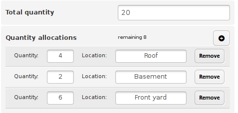

# The composite field type

A composite is a rarely used [field](Fields) type in leihs, because it's very specialized. A composite field looks like this:



In this example there are actually two fields, *Total quantity* with field ID `properties_total_quantity` and *Quantity allocations* with field ID `properties_quantity_allocations`.

The *Quantity allocations* field will count down from the value set in *Total quantity*. You can use this micro-manage fixed allocations of something that is available multiple times. In a typical leihs instance, concurrent software licenses are managed this way, with quantity usually being 1 and the location field used for the name of the person who received this license.

Of course software licenses can also be borrowed like physical items, so in case of a non-concurrent license (a single seat license), that would be preferred to using the quantity allocation composite field.

If you are curious about these two field definitions, they are:

```json
{
	"label": "Total quantity",
	"attribute": [
		"properties",
		"total_quantity"
	],
	"type": "text",
	"target_type": "license",
	"permissions": {
		"role": "inventory_manager",
		"owner": true
	},
	"visibility_dependency_field_id": "properties_license_type",
	"visibility_dependency_value": [
		"multiple_workplace",
		"site_license",
		"concurrent"
	],
	"group": "General Information"
}

{
  "label": "Quantity allocations",
  "attribute": [
    "properties",
    "quantity_allocations"
  ],
  "type": "composite",
  "target_type": "license",
  "permissions": {
    "role": "inventory_manager",
    "owner": true
  },
  "visibility_dependency_field_id": "properties_total_quantity",
  "data_dependency_field_id": "properties_total_quantity",
  "group": "General Information"
}

```
