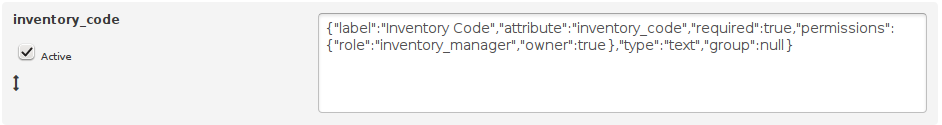

Fields are the location where data gets stored for each item. In leihs, we make no distinction between fields that map to columns in the database or fields whose data is serialized into a text column in the database. In the user interface when editing an item, both appear to you as input fields on the item edit form.

# Fields for models
Models have a fixed number of fields describing them, and the available fields cannot be customized. They are:
- **Product:** A real-world product name. Example: Xperia Z2 Tablet
- **Version:** A version number, usually used for software products. Example: 2.5.1.
- **Manufacturer**. Example: Sony.
- **Description:** A long-form text description also shown to customers when ordering/borrowing. Example: Waterproof tablet running CyanogenMod.
- **Technical Details:** Technical description of the item, shown on the detail page when ordering. Example: 12" Screen with vibrant colors, WiFi, GPS.
- **Internal Description:** Shown only to lending and inventory managers. Useful to keep information that customers don't need to see, perhaps written in internal shorthand. Example: Chargers on shelf 2.
- **Important notes for hand over:** Notes specifically for lending managers, prominently displayed during hand over. Example: Don't forget to include Micro-USB cable.

# Fields for items
Item fields can be customized to a large extent. There are however some core fields that are guaranteed to be present:
- **Inventory Code:** A unique alphanumeric code identifying this item. Example: INV1234. This is a string.
- **Model:** The model (see above) that this item is one of. Example: Sony Xperia Z2 Tablet. What actually gets stored in the database is the `model_id`, pointing to the `id` field of the `models` table.

The rest of the fields can be customized.

## Field editor
The field editor can be reached through Admin -> Fields. Each text area there represents and configures one field on the item editor. You can add new fields with the "Create Field" button and deactivate existing fields using the "Active" checkbox on the left. Deleting fields is not yet possible as implementing a safe way to do this without discarding any data is non-trivial.

This is a typical field. Here it's the rather important `inventory_code`:



From left to right we have:
- **inventory_code**, the id of the field. This must be unique and it's the name you can use to refer to the field in other places, such as when making another field depend on this one. The database will automatically make sure that all names are unique, if you try to add a field with an id that is already taken, you'll get an error message.
- **Active checkbox**: This field is active, which means it shows up on each item's item editor.
- **Reordering arrow**: You can grab fields by this arrow and reorder them via drag and drop. Actually, it doesn't matter where in the grey area you click and drag, the arrow is just there to indicate that this is draggable.

## Field definitions

The following is a typical field definition, which is written in [JSON](https://en.wikipedia.org/wiki/JSON).

```json
{
	"label":"Inventory Code",
	"attribute":"inventory_code",
	"required":true,
	"permissions": { "role":"inventory_manager", "owner":true },
	"type":"text",
	"group":null
}
```

These definitions are edited in simple text areas in leihs. You may of course use an external editor to syntax highlight and format your JSON more easily. If you don't want to install any software, a simple online editor we can recommend is [JSON Editor Online](http://jsoneditoronline.org/). Click the  button in the top left corner of that editor to have your code indented beautifully. With the left and right arrows you can convert your JSON into a graphically editable tree on the right and back to code on the left. This can help with e.g. comma errors when listing properties. You can then copy and paste your definition back into leihs' textareas when you're done.

Using such a JSON-specific editor helps make sure that you don't introduce syntax errors or other problems. If you do create a syntax error, leihs will not let you save any fields at all until you fix it, thus preventing problems with your database.

## Available keys and values

There are the keys and values that you can use, they are described in more detail below:

Key   | Type | Description  
----- | --- | --- | ---
attribute | String | Which DB column or hash key the data is saved in
data_dependency_field_id | Field ID | What data to use for a composite field
default | Any | What default value to use for this field
form_name | String | ?
forPackage | Boolean | Whether this field also appears on a package's edit form (not just items or licenses)
group | String | Group of interface elements to add this field to, or null for no grouping
label | String | The human-friendly label that appears for this field on the inventory editor
permissions | Hash | Hash of permissions and ownership restrictions
required | Boolean | If true, field must be filled in in order to save the item
search_attr | String | ???
search_path | String | ???
search_term | String | ???
target_type | String | Restrict the field to phsyical items or software licenses
type | String | The type of the field, such as string, integer, etc.
type | String | Type of the field
values | Array | An array of hashes of values and their labels that are available for this field
value_label | Array | ???
value_label_ext | Array | ???
visibility_dependency_field_id | Field ID | The field only appears if the field of the given id has the value specified by `visibility_dependency_value`
visibility_dependency_value | String | Combine with `visibility_dependency_field_id` to make a field only appear when another field has a certain value


### attribute

`attribute` specifies where data in this field is saved. There are two choices: a database column or the value part of a property hash, serialized into one big database column that contains all the other properties as well.

To decide between the two, there are a few considerations to take into account:

* Saving into the property hash is the easier and safer option. It requires no database changes and you run no risk of losing data. The downside is that with many (read: hundreds) of properties, performance of the item edit page might suffer.


* Saving into the database is the riskier option. It requires a database column of the correct name and type. You will have to maintain your own patches against the vanilla leihs database and it if vanilla leihs ever gains a field with the same name as yours, you might have to adapt your field definitions to kick out the vanilla field and reintroduce yours.

Either way is supported by the field editor.

#### Saving attributes into a database column

To save into a column, make sure the column is of the right type (the same type that you chose for the `type` of the field) and then simply give the name of that column as a string:

```json
"attribute" : "name_of_database_column"
```
Make sure the name contains only letters a to z and the underscore. If the column does not exist yet, you need to manually create it in your database. Please note that this is a potential source of errors if e.g. a future version of leihs introduces a field of the same name. You could for example prefix your column names with your organization's name, e.g.  `my_university_field_x`. Users will never notice this as they will only see the label you specify in the field's JSON configuration, not the column name.

Data stored in an attribute is never destroyed, even if you were to remove a field or make it save into a different property. If this ever becomes an issue for you, removing data can be done by going through all items with a script on the Rails console to clear that particular property and save the item.

#### Saving attributes into the property hash

To save into the properties hash, make the name of the property you want to use is not already in use, then give it in this array notation:

```json
"attribute" : ["properties", "name_of_property"]
```
The properties hash is always present and you can always define new attributes on it simply by declaring them in one of your fields. Make sure the names contain only letters a to z and the underscore.

You do not need to take particular care to prefix your property names with anything, but if you think it's likely that leihs itself might one day add a property with a name you're using, do prefix it now instead of later.

### permissions

A hash telling leihs who is allowed to do what on this field. There are two keys that you can specify:

* **role**: Defines which role a user needs to have (at least) to be able to write to this field. One of `lending_manager`, `inventory_manager`.
* **owner**: Whether the user's inventory pool needs to be the owner of this item in order to change this field. Otherwise they get a read-only field.

By default, ??? is set. An example permissions definition looks like this:

```json
"permissions" : { "role":"inventory_manager", "owner" : true }
```

### type

Type determines the datatype of the field. The following types are supported:

* **autocomplete-search**: A search field that autocompletes its selection by searching on a specific URL. Requires `search_path`, `search_attr`, `value_attr`, `display_attr` to be defined.
* **autocomplete**: An autocomplete field that allows searching in a list of values defined in the `values` array.
* **checkbox**: A group of checkboxes with values defined in the `values` array.
* **composite**: A widget that allows assigning quantities and strings to count down from a value specified in a dependent field. Slightly more complex, therefore [explained on a separate page](Composite-field-type)
* **date**: A date picker.
* **radio**: A group of radio buttons with values defined in the `values` array.
* **select**: A dropdown menu that shows values you can predefine. Requires `values` to be defined to be useful.
* **text**: Plain text, stored in UTF-8. Presented as a normal input box (single-line)
* **textarea**: Plain text, stored in UTF-8. Presented as a multi-line text area.


### target_type

Either `item` to make the field only appear on edit forms for physical items or `license` to appear only for software licenses. Not setting `target_type` at all makes fields appear on both items and software licenses.

### values

When you use field types that provide a selection, such as `select`, `checkbox` or `radio`, you need to specify which selections are possible. That's done through the `values` array. An example:

```json
"values" : [
  {
    "label": "Free",
    "value": "free"
  },
  {
    "label": "Single Workplace",
    "value": "single_workplace"
  },
  {
    "label": "Multiple Workplace",
    "value": "multiple_workplace"
  },
  {
    "label": "Site License",
    "value": "site_license"
  },
  {
    "label": "Concurrent",
    "value": "concurrent"
  }
]
```

This is taken directly from a live leihs instance and describes the types of software licenses available. Users see the label in the user interface, what's stored to the database or properties hash is the value.

You can specify a default in the separate `default` key.

### default

The default value for any field, although it is most useful in selection fields such as `select`, `checkbox`, etc. If the user picks nothing and enters nothing, this value is picked for them. Make sure the value you want actually exists in that field's values if you're using this with a selection field.

Example:

```json
"default":"free"
```

This would set the value of this field to the string "free" by default.

# Built-in arrays of values

There are some function names that you can use in place of values for your "values" configuration. They are:

 * `all_buildlings`: A list of all buildings as configured in the `buildings` table, sorted alphabetically.
 * `all_inventory_pools`: A list of all inventory pools in the system, sorted alphabetically.
 * `all_suppliers`: A list of all suppliers in the system, sorted alphabetically.
 * `all_currencies`: A list of all currencies known to the system, sorted alphabetically.


NOTE: This documentation is still incomplete but constantly being expanded. Expect a full list of all possible values in July 2015.
